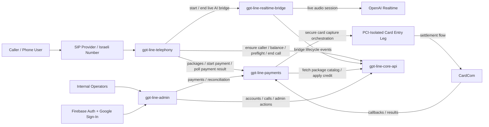
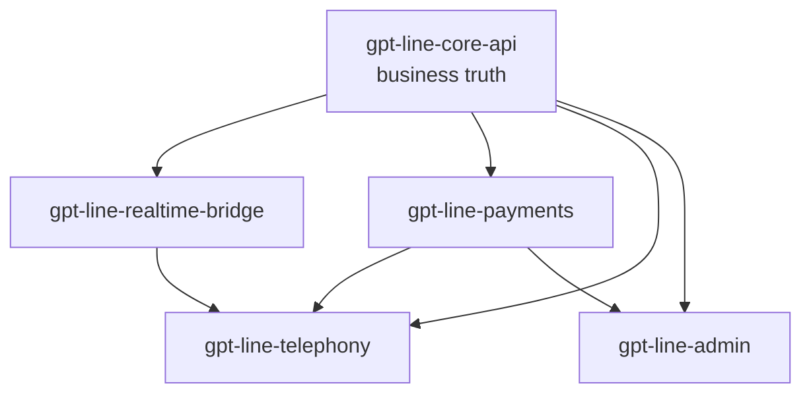

# GPT-Line Master Repository

This repository is the **master coordination repository** for the GPT-Line system.

It contains:

- the top-level product documentation
- the authoritative standalone specification files for each service
- the system dependency graphs
- the recommended development workflow
- Git submodules pointing to the actual implementation repositories of each service under the `services/` folder

The actual code for each service should live in its own dedicated GitHub repository. This master repository is the coordination layer and the canonical architecture reference.

---

## Purpose of this repository

This repository exists to define the full GPT-Line system in one place and keep every service contract aligned.

It should be used for:

- keeping the authoritative service specifications
- tracking the overall architecture
- defining ownership boundaries between services
- linking all service repositories together through Git submodules
- helping developers understand which repository owns which responsibility
- serving as the entry point for the whole project

This repository is **not** intended to contain the full implementation of all services directly inside it.

---

## GPT-Line services

The GPT-Line system is split into five implementation services plus this master coordination repository:

1. `gpt-line-telephony`
2. `gpt-line-realtime-bridge`
3. `gpt-line-core-api`
4. `gpt-line-payments`
5. `gpt-line-admin`

This master repository contains the six coordination documents:

1. `README.md`
2. `gpt-line-telephony.md`
3. `gpt-line-realtime-bridge.md`
4. `gpt-line-core-api.md`
5. `gpt-line-payments.md`
6. `gpt-line-admin.md`

Each service document is written so it can be handed directly to a developer or coding agent responsible for a single empty GitHub repository.

Each document includes:

- the service mission
- locked architectural decisions
- exact API contracts it consumes and/or exposes
- data model where relevant
- business rules
- security constraints
- required repository deliverables
- required tests
- operational expectations
- definition of done

The cross-service agreements are repeated consistently inside every document so the developer for one repository can build a compatible implementation without opening the others.

---

## Architectural principles

The following are system-wide and non-negotiable:

- Caller account identity is **phone number only**, stored everywhere as `phone_e164`
- Canonical phone number format is E.164, for example `+972501234567`
- The **Core API** is the single source of truth for:
  - accounts
  - balances in seconds
  - package catalog
  - call authorization
  - call finalization
  - ledger history
  - admin business operations
- The **Realtime Bridge** is the only service allowed to communicate directly with OpenAI Realtime
- The **Payments** service owns payment orchestration and settlement, but never owns balance truth
- The **Telephony** service owns IVR execution, DTMF handling, caller routing, and media orchestration at the phone edge
- The **Admin** service is the internal dashboard and must consume only backend APIs, never databases directly
- Raw payment card details must never enter Telephony, Core API, Redis, browser code, or ordinary logs
- Internal service-to-service traffic uses authenticated internal HTTPS APIs
- All timestamps are stored in UTC
- All end-reason enums and prompt enums must remain synchronized exactly as defined in these documents

---

## Canonical shared enums

These values are system-wide and must not diverge between services.

### Call ended reason enum

Allowed values:

- `star_exit`
- `caller_hangup`
- `time_expired`
- `system_error`
- `backend_revoke`
- `openai_error`
- `bridge_error`
- `telephony_disconnect`

Rules:

- Telephony may send any of these to Core when applicable
- Bridge may emit any of these to Core when applicable
- If a service has a more local/internal failure code, it must map it into one of the canonical values above before crossing service boundaries

### Deny prompt enum

Allowed values:

- `no_minutes`
- `system_error`
- `account_blocked`
- `account_under_review`
- `active_call_exists`

### Payment result prompt enum

Allowed values:

- `payment_success`
- `payment_failed`
- `payment_cancelled`
- `payment_unavailable`

### Bridge command enum

Allowed values:

- `play_warning`
- `force_end`

These are the canonical commands emitted by the Core API toward Telephony when Bridge timing events occur.

---

## Service dependency graph



---

## Hierarchy graph



Interpretation:

- `gpt-line-core-api` is the platform root
- `gpt-line-realtime-bridge` and `gpt-line-payments` depend on the Core API
- `gpt-line-telephony` depends on Core API, Realtime Bridge, and Payments
- `gpt-line-admin` depends on Core API and Payments

---

## Submodule structure

This master repository includes the following Git submodules inside the `services` folder, each pointing to its own standalone GitHub repository:

```text
services/gpt-line-core-api        → https://github.com/yossef6548/gpt-line-core-api
services/gpt-line-payments        → https://github.com/yossef6548/gpt-line-payments
services/gpt-line-realtime-bridge → https://github.com/yossef6548/gpt-line-realtime-bridge
services/gpt-line-telephony       → https://github.com/yossef6548/gpt-line-telephony
services/gpt-line-admin           → https://github.com/yossef6548/gpt-line-admin
```

To clone this repository with all submodules initialized, use:

```bash
git clone --recurse-submodules https://github.com/yossef6548/gpt-line
```

Or, if you have already cloned the repository, initialize and update the submodules with:

```bash
git submodule update --init --recursive
```

---

## Recommended repository role for each submodule

### `gpt-line-telephony`

Owns:

- Asterisk
- IVR
- prompts
- DTMF handling
- caller routing
- media-side call control
- payment handoff and return
- bridge-control polling from Core
- playing warning/cutoff prompts to callers

### `gpt-line-realtime-bridge`

Owns:

- live audio/session bridge
- OpenAI Realtime connection
- interruption handling
- warning/cutoff timers
- emitting bridge lifecycle and timing events to Core

### `gpt-line-core-api`

Owns:

- caller accounts by phone number
- remaining seconds
- package catalog
- call authorization
- call finalization
- ledger
- bridge-event intake
- bridge-command state for Telephony
- admin backend APIs
- active-call coordination

### `gpt-line-payments`

Owns:

- package purchase flow
- PCI-safe payment orchestration
- CardCom charging
- payment callbacks
- applying credits through Core API
- payment inspection and reconciliation APIs

### `gpt-line-admin`

Owns:

- internal dashboard
- Firebase Authentication with Google Sign-In
- operator access control by email allowlist
- account management UI
- call monitoring UI
- payment inspection UI

---

## Canonical cross-service coordination rules

### 1. Package ownership

- `gpt-line-core-api` is the authoritative source of package catalog data
- `gpt-line-payments` consumes the Core catalog and exposes a telephony-friendly package endpoint
- `gpt-line-telephony` must consume the package menu from `gpt-line-payments`, not from Core directly

### 2. Warning and cutoff signaling

The timing signal path is fixed and must not be reinterpreted:

1. Telephony preflights a call with Core
2. Core returns `absolute_cutoff_epoch_ms`, `warning_at_seconds`, and `call_session_id`
3. Telephony starts the Realtime Bridge with those values
4. Realtime Bridge emits timing events to Core:
   - `bridge-warning-due`
   - `bridge-cutoff-due`
5. Core stores those events and exposes the corresponding pending bridge command to Telephony
6. Telephony polls Core for pending bridge commands for the active `call_session_id`
7. On `play_warning`, Telephony plays `one_minute_left.wav` exactly once
8. On `force_end`, Telephony immediately ends the bridge, plays `time_expired.wav`, reports call end, and returns the caller to the main menu

This removes all ambiguity about how the caller actually hears the timing prompts.

### 3. Active call termination from Admin

The operator termination flow is fixed:

1. Admin calls `POST /admin/calls/:call_session_id/terminate` on Core
2. Core marks a pending `force_end` bridge command for that call with reason `backend_revoke`
3. Telephony sees that command through command polling
4. Telephony ends the bridge and finalizes the call
5. Core records the canonical end reason `backend_revoke`

### 4. Canonical end-reason mapping

Every service must use the shared enum exactly as listed above.
No service may invent additional external end reasons in API payloads.

### 5. Telephony secure payment handoff type

`transfer_target` returned by Payments is defined to mean:

```json
{
  "type": "asterisk_route",
  "context": "pci_capture",
  "extension": "start",
  "priority": 1
}
```

The exact route values may differ by environment, but the shape and semantics are fixed:

- `type` is always `asterisk_route`
- Telephony must transfer the caller to the specified Asterisk route
- that route enters the PCI-isolated payment capture leg

---

## Suggested development workflow

### Phase 1: contract hardening

Before implementation starts, treat these six files as the source of truth and do not allow service repos to drift from them.

### Phase 2: build in dependency order

Recommended implementation order:

1. `gpt-line-core-api`
2. `gpt-line-payments`
3. `gpt-line-realtime-bridge`
4. `gpt-line-telephony`
5. `gpt-line-admin`

### Why this order

#### 1. `gpt-line-core-api` first
It is the platform root and defines:

- accounts
- balances
- package catalog
- call preflight
- call finalization
- admin business APIs
- bridge command coordination

#### 2. `gpt-line-payments` and `gpt-line-realtime-bridge` second
Both depend on stable Core contracts and can be built once Core is ready.

#### 3. `gpt-line-telephony` fourth
It depends on all major backend services and should be built after their APIs are stable.

#### 4. `gpt-line-admin` last
It is primarily a consumer of stable Core and Payments admin APIs.

---

## Recommended integration milestones

### Milestone A: Core only
- ensure caller
- balance lookup
- preflight
- call end
- payment credit
- bridge command persistence
- admin account and call APIs

### Milestone B: Core + Payments
- package fetch
- payment session creation
- approved payment callback
- idempotent credit application
- admin payment inspection

### Milestone C: Core + Realtime Bridge
- bridge start
- bridge connected event
- warning event
- cutoff event
- bridge end
- Core bridge-command polling path

### Milestone D: Core + Payments + Bridge + Telephony
- real inbound call
- press 2 for balance inquiry
- press 1 for AI conversation
- press `*` to return to menu
- one-minute warning playback
- forced cutoff playback and return
- press 3 for payment flow
- return to menu after result

### Milestone E: Admin
- authenticate operator
- list and inspect accounts
- list and inspect calls
- list and inspect payments
- block/unblock and credit/debit
- reconcile approved payment
- terminate active call

---

## Current contents

At this stage, this repository contains:

- the specifications and project structure planning
- submodule references to each service repository under `services/`

As development progresses, it should also contain:

- top-level architectural notes
- deployment coordination notes
- shared operational documentation where useful

---

## Goal

The goal is that each service can be developed independently in its own repository while this master repository remains the single top-level entry point that defines the whole GPT-Line system, keeps all contracts aligned, and prevents cross-service mismatches.
